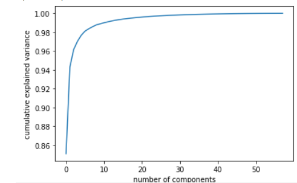

# Motor_Imagery_82_Percent

We have considered first 30 components of PCA out of 58 components 

Confusion Matrix

&nbsp;&nbsp;&nbsp;&nbsp;[[17  &nbsp;&nbsp;   5]  
&nbsp;&nbsp;&nbsp;&nbsp; [ 3  &nbsp;&nbsp;   19]]

PCA Cumulative Variance Graph

